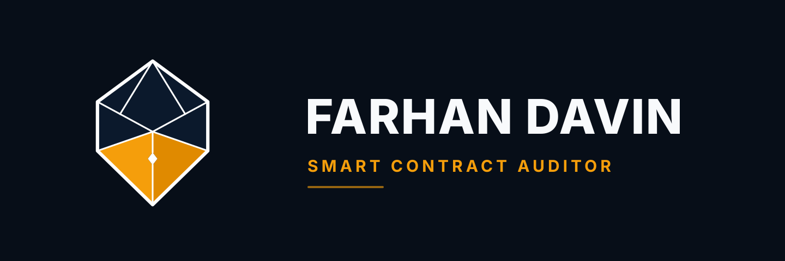

<p align="center">
  
</p>

<p align="center">
  <strong>Smart Contract Security Researcher & Formal Verification Specialist</strong><br/>
  Specializing in <em>Stateful Invariant Fuzzing (Foundry)</em> &amp; <em>Formal Verification (Certora / CVL)</em>
</p>

<p align="center">
  <a href="#-core-values--professional-ethics"></a>
  <a href="#-specialization-1-stateful-invariant-fuzzing-foundry"></a>
  <a href="#-specialization-2-formal-verification-certora--cvl"></a>
  <a href="#-educational--practice-audit-reports"></a>
  <a href="https://github.com/farhandavin"></a>
</p>

---

## 🧭 About Me

Welcome to my Smart Contract Security Portfolio. I am **Farhan Davin**, an independent smart contract security researcher dedicated to safeguarding decentralized protocols on Ethereum and EVM-compatible ecosystems.

My security approach is centered on mathematical precision and adversarial depth:
- **Stateful Invariant Fuzzing**: Uncovering edge-case protocol state corruptions through multi-actor, multi-action fuzz campaigns in Foundry.
- **Formal Verification (Certora Prover / CVL)**: Mathematically proving protocol correctness and safety properties across infinite execution branches.

---

## ⚖️ Core Values & Professional Ethics

> *"Security without honesty is an illusion. Trust is earned through absolute transparency and verifiable truth."*

I hold myself to the highest standard of professional integrity and Islamic ethics (*Amanah & Sidq*):

| Principle | Meaning & Operational Commitment |
| :--- | :--- |
| **Honesty (*Jujur*) & Transparency (*Transparansi*)** | **Zero inflated claims.** I explicitly distinguish between in-depth educational/training audits and live production contest wins. Every vulnerability analysis, PoC, and formal spec in this repository is 100% genuine and reproducible. |
| **Trustworthiness (*Amanah*)** | All private client engagements, unreleased codebases, and pre-disclosure vulnerability findings are treated with strict confidentiality and fiduciary responsibility. |
| **Fulfilling Promises (*Menepati Janji*)** | Punctual delivery, adherence to scoped timelines, and consistent communication from kick-off to post-audit mitigation verification. |
| **Professional Excellence (*Profesional & Berkualitas*)** | Deep mathematical and stateful verification that goes far beyond surface-level linters, delivering actionable remediation guidance with reproducible Foundry PoCs. |
| **Facilitating Developers (*Mempermudah*)** | Audit reports are written to empower development teams—providing clean pull-request recommendations, runnable reproduction scripts, and minimal friction. |
| **Generosity (*Murah Hati*)** | Giving back to the Web3 community by open-sourcing formal verification specs, fuzzing harnesses, and security educational resources. |

---

## 🔬 Core Technical Specializations

```
                                    ┌──────────────────────────────────────────────────────────┐
                                    │               PROTOCOL SECURITY POSTURE                  │
                                    └────────────────────────────┬─────────────────────────────┘
                                                                 │
                                ┌────────────────────────────────┴────────────────────────────────┐
                                ▼                                                                 ▼
                 ┌──────────────────────────────┐                                  ┌──────────────────────────────┐
                 │  STATEFUL INVARIANT FUZZING  │                                  │     FORMAL VERIFICATION      │
                 │      Foundry / Handlers      │                                  │     Certora Prover / CVL     │
                 └──────────────┬───────────────┘                                  └──────────────┬───────────────┘
                                │                                                                 │
                   • Handler-based actions                            • Exhaustive SMT / SAT proofs
                   • Ghost accounting invariants                      • State transition equivalence
                   • Conservation of tokens law                       • Bounded & unbounded math checks
                   • Strict `fail_on_revert = true`                   • Storage mutation hooks
```

---

### 🛡️ Specialization 1: Stateful Invariant Fuzzing (Foundry)

Stateless unit tests only verify expected linear paths. My auditing methodology builds **Handler-based stateful invariant test suites** that simulate thousands of randomized, interdependent transactions across multiple actors to break core protocol invariants.

#### Invariant Testing Methodology:
1. **System Invariant Definition**: Formalizing mathematical conservation laws (e.g., $\sum \text{Balances} \le \text{Total Supply}$, Solvency equations, $x \cdot y \ge k$).
2. **Actor & Environment Modeling**: Simulating distinct personas (Liquidity Providers, Borrowers, Liquidators, Arbitrageurs) via bounded `Handler.t.sol` harnesses.
3. **Ghost Accounting**: Embedding internal shadow accounting in the handler to track expected state transitions and uncover phantom fees, rounding deficits, or hidden inflation.
4. **Strict Revert Enforcement**: Running fuzz runs with `fail_on_revert = true` to ensure no state transition reverts silently or disguises critical logic regressions.

#### Sample Invariant Test Architecture:
```solidity
// Example: Stateful Ghost Accounting in ThunderLoan Invariant Suite
function invariant_assetTokenUnderlyingBalance() public {
    uint256 underlyingBalance = tokenA.balanceOf(address(assetToken));
    uint256 exchangeRate = assetToken.getExchangeRate();
    uint256 totalSupply = assetToken.totalSupply();
    uint256 requiredBacking = (totalSupply * exchangeRate) / assetToken.EXCHANGE_RATE_PRECISION();

    uint256 ghostDeficit = handler.ghostProtocolDeficit();

    // Invariant: Physical reserves must balance liabilities minus tracked accounting anomalies
    assertGe(requiredBacking, underlyingBalance, "Invariant: Required backing less than physical balance");
    assertApproxEqAbs(
        requiredBacking - underlyingBalance,
        ghostDeficit,
        handler.totalOperations() + 10,
        "Invariant: Reserve deficit diverges from ghost accounting model"
    );
}
```

---

### 📐 Specialization 2: Formal Verification (Certora Prover & CVL)

While fuzzing tests millions of randomized states, **Formal Verification (FV)** uses mathematical solvers (SMT/SAT) to exhaustively prove that a property holds across **all possible inputs and state configurations**, or produces a concrete counterexample.

I write specifications using the **Certora Verification Language (CVL)** for math libraries, state-machine transitions, and access-control invariants.

#### Formal Verification Case Studies:
- **Case Study 1: Math Masters Fixed-Point Library (`MulWadUp`)**  
  *Target:* Fixed-point arithmetic scaling and rounding up (`MulWadUp.sol`).  
  *Proof:* SMT solver verification proving exact bounded ceiling arithmetic ($x \cdot y = 0 \implies 0$ else $(x \cdot y - 1)/\text{WAD} + 1$) without overflow vulnerabilities across full `uint256` domains.
- **Case Study 2: NFT Marketplace Differential Formal Verification**  
  *Target:* State transition equivalence between standard and gas-optimized marketplace implementations (`GasBadNftMarketplace.sol` vs. `NftMarketplace.sol`).  
  *Proof:* Proves parametric function equivalence (`method f, method f2`) and verifies event emission integrity via storage hooks (`hook Sstore`) and ghost variable counters.

#### Sample CVL Specification Snippet:
```cvl
// Equivalence proof: Both contracts must transition to identical states for any arbitrary execution
rule calling_any_function_should_result_in_each_contract_having_the_same_state(
    method f, method f2, address listingAddr, uint256 tokenId, address seller
) {
    env e; calldataarg args;

    // Preconditions: Initial states match
    require(gasBadMarketplace.getProceeds(e, seller) == marketplace.getProceeds(e, seller));
    require(gasBadMarketplace.getListing(e, listingAddr, tokenId).price == marketplace.getListing(e, listingAddr, tokenId).price);
    require(f.selector == f2.selector);

    // Transition
    gasBadMarketplace.f(e, args);
    marketplace.f2(e, args);

    // Postconditions: Final states match identically
    assert(gasBadMarketplace.getListing(e, listingAddr, tokenId).price == marketplace.getListing(e, listingAddr, tokenId).price);
    assert(gasBadMarketplace.getProceeds(e, seller) == marketplace.getProceeds(e, seller));
}
```

---

## 📑 Educational & Training Security Audits

> [!NOTE]
> **Transparency Disclosure**: The reports below represent intensive, comprehensive security reviews conducted on protocols from the **Cyfrin Updraft Smart Contract Security Curriculum** and independent adversarial research. They showcase my end-to-end auditing rigor, vulnerability analysis, and publication-ready report drafting. I am currently expanding into live public competitive contests (CodeHawks, Sherlock, Code4rena) and private protocol reviews.

| Protocol | Date | Architecture / Scope | Core Vulnerabilities Identified | Audit Report |
| :--- | :---: | :--- | :--- | :---: |
| **Vault Guardians** | Sep 2026 | ERC4626 Vaults, Uniswap V2, Aave V3 (589 nSLOC) | Reentrancy, Fee Bypass via `mint()`, Liquidity Starvation DoS, Slippage Flaws | [📄 View PDF Report](./VaultGuardians-Security-Audit-Report.pdf) |
| **Thunder Loan** | Sep 2026 | Flash Loan Protocol, AMM Oracles, UUPS Proxy (475 nSLOC) | Flash Loan Reentrancy, Spot Oracle Manipulation, Storage Layout Collision | [📄 View PDF Report](./ThunderLoan-Security-Audit-Report.pdf) |
| **Boss Bridge** | Sep 2026 | Cross-Chain L1-L2 Token Bridge (215 nSLOC) | Signature Replay Attacks, Arbitrary `transferFrom` Address, Low-Level Call Hijack | [📄 View PDF Report](./BossBridge-Security-Audit-Report.pdf) |
| **T-Swap** | Sep 2026 | Constant-Product AMM ($x \cdot y = k$) (345 nSLOC) | Pool Reserve Drain via Reward Incentive, Math Precision Flaws, Missing Slippage | [📄 View PDF Report](./TSwap-Security-Audit-Report.pdf) |
| **Puppy Raffle** | Sep 2026 | NFT Raffle & Lottery System (143 nSLOC) | Reentrancy in `refund()`, Weak PRNG Exploit, Unbounded Loop $O(n^2)$ DoS | [📄 View PDF Report](./PuppyRaffle-Security-Audit-Report.pdf) |
| **PasswordStore** | Sep 2026 | Private Password Vault (25 nSLOC) | On-Chain Storage Slot Transparency, Missing Access Control in `setPassword()` | [📄 View PDF Report](./PasswordStore-Security-Audit-Report.pdf) |

---

## 🔍 Highlighted Vulnerability Case Studies

<details>
<summary><strong>1. Vault Guardians: ERC4626 Protocol Fee Bypass & State Freezes</strong></summary>

- **Target:** Decentralized vault yield strategy utilizing ERC4626 vault shares, Aave V3 lending pools, and Uniswap V2 LP tokens.
- **Root Cause & Impact:**
  - Standard `ERC4626::mint()` allowed depositors to bypass fee accounting and guardian stake requirements.
  - Liquidity divestment calculation had an unbounded dependency on idle capital, freezing redemptions whenever `maxWithdraw == 0`.
- **Mitigation & Verification:** Rewrote deposit routing with override guards and verified solvency across stateful invariant fuzzing harnesses with `fail_on_revert = true`.
</details>

<details>
<summary><strong>2. Thunder Loan: Flash Loan Deposit Reentrancy & Oracle Manipulation</strong></summary>

- **Target:** Uncollateralized flash loan protocol with dynamic AMM fee calculation and UUPS upgradeable proxies.
- **Root Cause & Impact:**
  - Flash loan borrowers could reenter via `deposit()` with borrowed tokens, satisfying the repayment balance check while minting unbacked liquidity shares.
  - AMM spot oracle allowed flash-swap price manipulation that forced calculated loan fees to zero.
- **Mitigation & Verification:** Implemented strict non-reentrant guards, time-weighted average price (TWAP) feeds, and built a 384,000-call Foundry invariant harness proving reserve deficit consistency.
</details>

<details>
<summary><strong>3. Boss Bridge: Missing Signature Replay Protection & Vault Drainage</strong></summary>

- **Target:** L1-L2 cross-chain bridge handling token deposits and validator-signed withdrawals.
- **Root Cause & Impact:**
  - Validator signatures in `sendToL1` omitted nonces, chain IDs, and consumed-signature mappings, allowing attackers to replay a single withdrawal signature until the vault was emptied.
  - Arbitrary `from` parameter in `depositTokensToL2` enabled draining tokens approved to the bridge by other users.
- **Mitigation & Verification:** Integrated EIP-712 typed data hashing with nonces, enforced `msg.sender == from`, and verified fixes with 100% exploit PoC pass rates in Foundry.
</details>

<details>
<summary><strong>4. T-Swap: Constant-Product Invariant Breakdown ($x \cdot y = k$)</strong></summary>

- **Target:** Uniswap V1-style Automated Market Maker.
- **Root Cause & Impact:**
  - Protocol reward incentives transferred tokens directly out of pool reserves without updating internal pool balances, degrading the constant product invariant ($x \cdot y < k$) and enabling recursive liquidity drainage.
- **Mitigation & Verification:** Separated reward accounting from core reserves and verified pool conservation properties through invariant property assertions.
</details>

---

## 🛠️ Security Methodology: The Tincho Method

Every protocol review adheres to an 8-phase disciplined security framework:

```
[Phase 0: Readiness] ──> [Phase 1: Scoping] ──> [Phase 2: Recon & Invariants] ──> [Phase 3: Line-by-Line]
                                                                                          │
[Phase 8: Mitigation] <── [Phase 6-7: Report] <── [Phase 5: PoC / Invariants] <── [Phase 4: Adversarial]
```

1. **Phase 0: Audit Readiness (The Rekt Test)** — Assessing documentation clarity, test coverage baselines, and dependency pinning.
2. **Phase 1: Scoping & Complexity Mapping** — Determining nSLOC, external integrations, and architecture boundaries.
3. **Phase 2: Reconnaissance & Invariant Definition** — Threat modeling, mapping money flows, identifying privileged actors, and formalizing system invariants.
4. **Phase 3: Line-by-Line Code Review** — Manual inspection of state transitions, Checks-Effects-Interactions (CEI), and FREI-PI patterns.
5. **Phase 4: Adversarial Attack Vectoring** — Investigating MEV/sandwich attacks, flash-loan price manipulation, signature malleability, and reentrancy vectors.
6. **Phase 5: Automated Testing & PoC Construction** — Developing deterministic Foundry exploit test cases and stateful invariant harnesses.
7. **Phase 6 & 7: Classification & Executive PDF Reporting** — Categorizing findings using Cyfrin / CodeHawks severity criteria and compiling professional LaTeX/Eisvogel PDF reports.
8. **Phase 8: Mitigation Review & Verification** — Re-auditing client remediation pull requests to confirm vulnerability resolution without regressions.

---

## 🧰 Tools & Technology Stack

- **Testing & Execution Framework:** Foundry (`forge`, `cast`, `anvil`)
- **Formal Verification:** Certora Prover, CVL (Certora Verification Language)
- **Static Analysis:** Slither, Aderyn
- **Smart Contract & Low-Level Languages:** Solidity, Yul, Huff, CVL
- **Report Compilation:** Pandoc, Eisvogel LaTeX Engine, KaTeX

---

## 📬 Contact & Engagements

I am available for **private smart contract security audits**, **invariant fuzzing harness development**, and **formal verification engagements**:

- **GitHub:** [@farhandavin](https://github.com/farhandavin)
- **CodeHawks Profile:** [farhandavin](https://codehawks.com)
- **Specialization:** Stateful Invariant Testing, Certora Formal Verification, DeFi Architecture, EVM Security

---

<p align="center">
  <sub>Upholding Truth, Precision, and Trust in Web3 Security.</sub>
</p>
