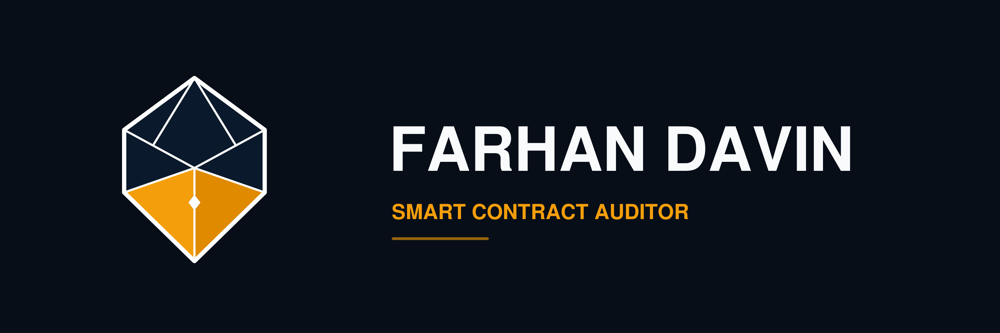

# Farhan Davin — Official Brand & Identity Guide
### Smart Contract Security Auditor

Panduan identitas visual resmi untuk portofolio dan dokumen laporan audit keamanan smart contract (**Smart Contract Security Audit Reports**).



---

## ✒️ Identitas Resmi: Executive Broad Nib (The Diamond Breather Edition)

Logo resmi Farhan Davin menggabungkan siluet mata pena kaligrafi presisi (*Precision Fountain Nib*) dan geometri heksagonal perisai audit (*Hexagonal Security Shield*). Lubang ventilasi tengah dirancang dengan siluet belah ketupat (*Diamond Breather Hole*) murni tanpa pupil biologis, menghadirkan estetika kemewahan mekanis (*haute horlogerie & precision engineering*) yang mencerminkan ketelitian audit bytecode tingkat tinggi.

---

## 🛡️ Filosofi 8 Nilai Luhur Auditor Smart Contract

| Nilai | Visual Metaphor | Implementasi Arsitektur Geometri |
|---|---|---|
| **Jujur & Transparan** | *Pure Negative Space Diamond & Slit* | Lubang belah ketupat (*diamond breather hole*) dan celah tinta vertikal murni tembus pandang tanpa ada pupil/titik tersembunyi. Menggambarkan metode audit *glass-box* — seluruh logika smart contract dianalisis secara transparan. |
| **Amanah** | *Hexagonal Shield & Solid Facets* | Rangka luar heksagonal kokoh yang memayungi faset-faset geometris, melambangkan tanggung jawab besar menjaga keamanan dana dan likuiditas protokol Web3. |
| **Menepati Janji** | *Razor Broad Tip (Titik Nol Presisi)* | Ujung mata pena di bagian bawah meruncing tepat di koordinat `(500, 810)`, mencerminkan ketepatan waktu dan komitmen penuntasan audit sesuai *service level agreement* (SLA). |
| **Berkualitas Tinggi** | *Sub-pixel Facet Symmetry & 7px Uniform Strokes* | Simetri matematis kiri dan kanan sempurna pada sumbu tengah `x=500` dengan ketebalan garis arsitektural 7px seragam di seluruh sambungan. |
| **Profesional** | *Deep Navy Spire & Wings* | Faset atas berwarna Deep Navy (`#0B192C`), warna klasik otoritas finansial dan ketenangan analitis tingkat eksekutif. |
| **Mempermudah** | *Mechanical Ink Channel* | Celah tinta yang lurus dan bersih memandu pembaca, mencerminkan kemampuan auditor mengurai kerumitan ratusan baris kode Solidity menjadi laporan yang mudah dipahami developer. |
| **Murah Hati (Approachable)** | *Warm Amber Gold Blades* | Sayap pisau pena bawah berwarna Amber Gold hangat (`#F59E0B` dan `#E08A00`), melambangkan kepribadian auditor yang ramah, kooperatif, dan siap membimbing tim klien dalam fase remediasi. |
| **Simple, Scalable & Fleksibel** | *Pure Vector Architecture* | Dirancang dalam format SVG vektor murni yang dapat diskalakan dari favicon 16x16px hingga sampul laporan A4 300 DPI dengan ketajaman absolut tanpa artefak. |

---

## 🎨 Palet Warna Resmi (Brand Colors)

| Peran | Nama Warna | Nilai HEX | RGB | Filosofi & Kegunaan |
|---|---|---|---|---|
| **Deep Trust** | Midnight Navy | `#0B192C` | `rgb(11, 25, 44)` | Faset mahkota & sayap atas. Menghadirkan wibawa, stabilitas, dan keamanan tingkat institusi. |
| **Action & Warmth** | Amber Gold | `#F59E0B` | `rgb(245, 158, 11)` | Sayap pisau pena kiri & aksen garis. Energi, kehangatan, dan komitmen. |
| **Depth & Facet** | Deep Amber | `#E08A00` | `rgb(224, 138, 0)` | Sayap pisau pena kanan. Memberikan efek kedalaman pencahayaan 3D alami. |
| **Purity & Line** | Crisp White | `#FFFFFF` | `rgb(255, 255, 255)` | Garis arsitektural 7px, lubang diamond, bingkai luar, dan tipografi sampul. |
| **Background Dark** | Executive Dark Navy | `#070E18` | `rgb(7, 14, 24)` | Latar belakang sampul tema gelap mewah (Dark Navy Edition). |
| **Background OLED** | Pitch Black | `#000000` | `rgb(0, 0, 0)` | Latar belakang tema kontras tinggi OLED. |

---

## 📂 Master Asset Suite (Folder `brand/executive_suite/`)

| File | Format | Deskripsi & Rekomendasi Penggunaan |
|---|---|---|
| [`nib-dark-navy-framed.pdf`](file:///d:/project%20farhan/BlockChain/Smart%20Contract%20Security%20Auditor/audit-portfolio/brand/executive_suite/nib-dark-navy-framed.pdf) | PDF / SVG / PNG | **Master Sampul Laporan Audit Resmi (Midnight Navy Cover)** |
| [`nib-dark-pitch-black-framed.pdf`](file:///d:/project%20farhan/BlockChain/Smart%20Contract%20Security%20Auditor/audit-portfolio/brand/executive_suite/nib-dark-pitch-black-framed.pdf) | PDF / SVG / PNG | Master Sampul Tema Gelap Kontras Tinggi (OLED Black) |
| [`nib-master-white.pdf`](file:///d:/project%20farhan/BlockChain/Smart%20Contract%20Security%20Auditor/audit-portfolio/brand/executive_suite/nib-master-white.pdf) | PDF / SVG / PNG | Master Sampul Cetak Dokumen Terang (Light Executive Cover) |
| [`nib-master-transparent.png`](file:///d:/project%20farhan/BlockChain/Smart%20Contract%20Security%20Auditor/audit-portfolio/brand/executive_suite/nib-master-transparent.png) | PNG / SVG / PDF | Aset Vektor Transparan untuk Profil Sosial Media, GitHub, & Web |
| [`nib-horizontal-dark.png`](file:///d:/project%20farhan/BlockChain/Smart%20Contract%20Security%20Auditor/audit-portfolio/brand/executive_suite/nib-horizontal-dark.png) | PNG / SVG / PDF | Banner Header Dokumen, Header LinkedIn, Footer Laporan |
| [`nib-stacked-dark.png`](file:///d:/project%20farhan/BlockChain/Smart%20Contract%20Security%20Auditor/audit-portfolio/brand/executive_suite/nib-stacked-dark.png) | PNG / SVG / PDF | Logo Badge Kotak untuk Kartu Bisnis & Slide Presentasi |
| [`nib-watermark-10pct.png`](file:///d:/project%20farhan/BlockChain/Smart%20Contract%20Security%20Auditor/audit-portfolio/brand/executive_suite/nib-watermark-10pct.png) | PNG / SVG / PDF | Watermark Latar Belakang Dokumen Audit (Opasitas 10%) |

---

## 📄 Snippet Penggunaan Cover Eisvogel / Pandoc

```latex
\begin{titlepage}
    \newpagecolor{cBg}
    \centering
    \vspace*{1.2cm}
    \begin{figure}[h]
        \centering
        \includegraphics[width=0.38\textwidth]{logo_navy.pdf}
    \end{figure}
    \vspace*{1.2cm}
    {\fontsize{26}{32}\selectfont\bfseries\color{cTitle} PASSWORDSTORE PROTOCOL\par}
    \vspace{0.4cm}
    {\fontsize{14}{18}\selectfont\bfseries\color{cSub} SMART CONTRACT SECURITY AUDIT REPORT\par}
    \vspace{0.8cm}
    {\color{cAccent}\rule{0.25\textwidth}{1.5pt}\par}
    \vspace{0.8cm}
    {\large\color{cMuted} Version 1.0 $\cdot$ Comprehensive Security Assessment\par}
    \vspace{2.0cm}
    {\small\scshape\color{cMuted} PREPARED BY\par}
    \vspace{0.25cm}
    {\Large\bfseries\color{cTitle} FARHAN DAVIN\par}
    \vspace{0.15cm}
    {\normalsize\color{cAccent} Smart Contract Security Auditor\par}
    \vfill
    {\small\color{cMuted} October 2026 $\cdot$ Independent Security Review\par}
    \vspace*{0.8cm}
\end{titlepage}
```
